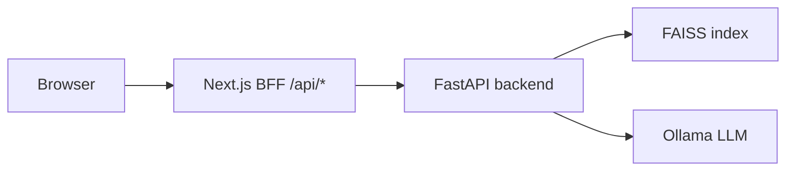

# Movie Recommendation System

**MovieMatch** helps you discover films similar to ones you love. Search by title, get a ranked top-10 list, sort results, and optionally generate AI-powered insights for each pick via a local **Ollama** model.

## Overview

- **Movie Recommendations**: Hybrid ranking (semantic similarity + rating + popularity) over a local FAISS index.
- **AI Insights**: Per-recommendation analysis comparing your seed movie to each pick — plot summary, why it was recommended, audience fit, contrast notes, and discussion questions.
- **Rich movie cards**: Genres, cast, director, rating, match %, and release year at a glance.
- **Sortable results**: Re-order recommendations by best match, rating, popularity, or release year.

## Architecture

- **Frontend**: Next.js (Pages Router) in `src/` — browser calls Next.js API routes (`/api/*`), which proxy to FastAPI.
- **Backend**: FastAPI in `backend/` — FAISS + sentence-transformers for recommendations; Ollama for insights.



## Project structure

```
backend/              FastAPI app (recommender, summarizer, FAISS)
src/                  Next.js frontend + BFF API routes
  components/         UI (AppHeader, SearchBar, MovieCard, InsightsModal, …)
  lib/                Shared helpers (sorting, constants, formatting)
data/                 Metadata CSV + local FAISS index (gitignored)
pipeline/archive/     Historical Jupyter notebooks (not used at runtime)
tests/                Pytest suite + Vitest frontend tests
scripts/              Dev orchestration (dev.sh)
```

## Setup

### 1. Install dependencies

```bash
make setup
```

This creates the Python virtualenv, installs Python packages, and runs `npm install`.

### 2. Install Ollama and pull a model

Install [Ollama](https://ollama.com/), then pull a model that matches your `.env`:

```bash
ollama list
ollama pull llama3.2:1b-instruct-q4_K_M
```

### 3. Configuration

```bash
cp .env.example .env
```

| Variable | Default | Purpose |
|----------|---------|---------|
| `OLLAMA_BASE_URL` | `http://localhost:11434` | Ollama server URL |
| `OLLAMA_MODEL` | `llama3.2:1b-instruct-q4_K_M` | Model name from `ollama list` |
| `SKIP_SUMMARY` | `false` | Set `true` to disable AI insights |
| `FAISS_INDEX_PATH` | `data/faiss_index` | Vector index |
| `METADATA_CSV` | `data/final_metadata.csv` | Movie metadata source |
| `BACKEND_URL` | `http://127.0.0.1:8000` | Next.js BFF proxy target |

### 4. Build FAISS index (required for recommendations)

```bash
make index
```

## Running locally

**One command (recommended):**

```bash
npm run dev
# or: make dev
```

This will:
1. Start Ollama if it is not already running
2. Start the FastAPI backend on http://127.0.0.1:8000
3. Start the Next.js frontend on http://localhost:3000

Open http://localhost:3000

Health check: http://127.0.0.1:8000/health — expect `"llm": true` and `"faiss": true`.

The header shows live status pills for **Recommendations ready** (FAISS) and **AI insights ready** (Ollama).

## Testing

```bash
source .venv/bin/activate
pytest -v
pytest -m integration
npm run test:frontend
```

## Usage

1. Open http://localhost:3000
2. Type a movie title and select from the autocomplete dropdown
3. Recommendations load automatically after selection (top 10 similar films)
4. Use **Sort by** to reorder results:
   - Best match (default hybrid score)
   - Rating (high → low / low → high)
   - Popularity (high → low / low → high)
   - Release year (newest / oldest)
5. Click **Explore match** on a card to generate AI insights (requires Ollama)

Each recommendation card shows:
- Poster, title, **genres**, year, language, ★ rating
- **Director** and **cast** (formatted for readability)
- Match % badge

The insights modal includes:
- **Summary** — brief plot overview generated from TMDB data
- **Why recommended** — connection to your seed movie
- **Who should watch** — ideal audience
- **Contrast note** — tone/pace/style differences from the seed film
- **Discussion questions** — three short prompts

## API Endpoints (FastAPI)

| Endpoint | Method | Description |
|----------|--------|-------------|
| `/health` | GET | `{ faiss, llm, movies }` status |
| `/api/movies` | GET | Movie list for autocomplete |
| `/recommendations` | POST | `{ "id": 272 }` or `{ "title": "Batman Begins" }` |
| `/insights` | POST | Generate AI insights for a recommended movie |

### Recommendations response fields

Each item in the `/recommendations` array includes:

| Field | Description |
|-------|-------------|
| `movie_id`, `movie`, `year`, `language`, `score` | Core metadata |
| `synopsis`, `poster_path`, `popularity` | Plot overview and TMDB poster |
| `genres`, `cast`, `director` | Formatted display metadata |
| `similarity_score`, `final_score` | Match scores used for ranking and sorting |

### Insights request / response

**POST** `/insights`

```json
{
  "seed_movie_id": 272,
  "recommended": {
    "movie": "The Dark Knight",
    "year": 2008,
    "language": "English",
    "score": 8.5,
    "synopsis": "...",
    "genres": "Drama, Action, Crime, Thriller",
    "cast": "Christian Bale, Heath Ledger, Michael Caine",
    "director": "Christopher Nolan"
  }
}
```

**Response:**

```json
{
  "insights": {
    "summary": "...",
    "why_recommended": "...",
    "who_should_watch": "...",
    "contrast_note": "...",
    "discussion_questions": ["...", "...", "..."]
  }
}
```

### Next.js BFF routes

| Route | Proxies to |
|-------|------------|
| `/api/health` | `/health` |
| `/api/movies` | `/api/movies` |
| `/api/recommendations` | `/recommendations` |
| `/api/insights` | `/insights` |

## Pipeline (archived)

Earlier research notebooks (Weaviate, quantization, etc.) live in [`pipeline/archive/`](pipeline/archive/). They are **not** part of the current runtime. See [`pipeline/archive/README.md`](pipeline/archive/README.md) for details.

## Eval harness

```bash
python backend/eval_recommendations.py
```

## License

MIT License
